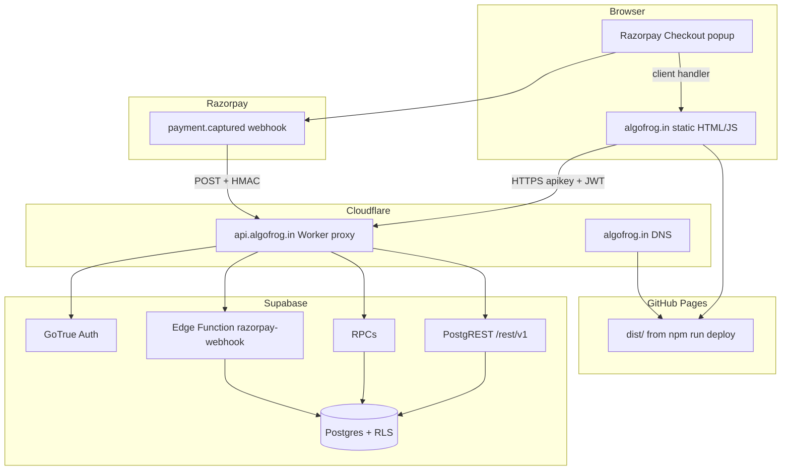

# algofrog.in — architecture

[algofrog.in](https://algofrog.in) is a static Astro site on **GitHub Pages** with a **Supabase** backend (auth, Postgres, RLS, Edge Functions). A **Cloudflare Worker** at `api.algofrog.in` reverse-proxies Supabase so Indian ISPs that block `*.supabase.co` do not break the app. **Razorpay** handles payments; activation is **webhook-only** (no trusted client RPCs).

---

## System overview



| Layer | Technology | Role |
|-------|------------|------|
| Frontend | Astro 6, vanilla TS in `.astro` scripts | SPA-like pages; no SSR at runtime |
| Hosting | GitHub Pages (`gh-pages` branch) | Serves `dist/` at `algofrog.in` |
| API access | Cloudflare Worker | `api.algofrog.in` → `*.supabase.co` + CORS |
| Backend | Supabase | Auth, Postgres, PostgREST, RPCs, Edge Functions |
| Payments | Razorpay Checkout + webhook | Pro subscription + Connect slot booking |

---

## Pages

| Route | File | Purpose |
|-------|------|---------|
| `/` | `src/pages/index.astro` | DSA guide — topics/problems loaded from Supabase after login |
| `/login` | `src/pages/login.astro` | Google OAuth (PKCE) |
| `/auth/callback` | `src/pages/auth/callback.astro` | OAuth code exchange |
| `/expired` | `src/pages/expired.astro` | Trial ended; upgrade CTA |
| `/connect` | `src/pages/connect.astro` | Mentor booking, slots, Razorpay |
| `/admin` | `src/pages/admin.astro` | Admin: slots, interests, paid bookings, Pro subscribers |

There are no dynamic Astro routes. Each page is a separate HTML entry with client-side Supabase calls.

---

## Frontend data flow (guide)

1. User opens `/` → shell HTML only (`visibility:hidden` until data loads).
2. `supabase.auth.getSession()` — redirect to `/login` if missing.
3. Load `subscriptions` row → trial / Pro / expired gating.
4. Fetch `topics` (+ embedded `topic_content`, `problems`) per entitlement.
5. Client renders sidebar, topic cards, progress, insight overlays into the DOM.

Content lives in **Supabase tables**, not in the static bundle. Scripts under `scripts/` can sync or seed DB content locally.

---

## Auth

- **Provider:** Google OAuth via Supabase Auth.
- **Flow:** PKCE (`src/lib/supabase.ts` — `flowType: 'pkce'`, `detectSessionInUrl: false`).
- **Callback:** `/auth/callback` exchanges code; redirect helpers in `src/lib/auth-redirect.ts`.
- **Dashboard URLs:** Site URL `https://algofrog.in`; redirects for `algofrog.in/**` and `localhost:4321/**`.

Sessions persist in `localStorage` (Supabase client default).

---

## Entitlements

| State | Source | Guide access |
|-------|--------|--------------|
| Trial | `subscriptions.status = trial`, `trial_ends_at` in future | Preview topic set + trial features |
| Pro | `status = active`, `paid_until` in future | Full guide + study preferences RPC |
| Expired | trial ended, not Pro | Free topics only (`topics.is_free`) |

Admin: `subscriptions.is_admin` → `/admin` link and admin RPCs.

---

## API proxy (India ISP workaround)

Indian ISPs may block direct `*.supabase.co`. Production builds set:

```env
PUBLIC_SUPABASE_URL=https://api.algofrog.in
```

The Worker (`workers/supabase-proxy/`) forwards all paths to the real Supabase project and adds CORS for `algofrog.in`, `www.algofrog.in`, and local dev.

**Deploy:** see [CLOUDFLARE_SUPABASE_PROXY.md](./CLOUDFLARE_SUPABASE_PROXY.md).

**Important:** Worker must allow PostgREST headers (`accept-profile`, `content-profile`, etc.) and strip duplicate upstream CORS headers.

---

## Payments

### Client flow

1. User clicks pay → Razorpay Checkout (`checkout.razorpay.com`) with `PUBLIC_RAZORPAY_KEY_ID`.
2. `notes` on the order identify payment type (`src/lib/payment-await.ts`):
   - **Pro:** `{ type: 'pro', user_id, plan }`
   - **Connect:** `{ type: 'connect', user_id, slot_id, service_id, amount_paise }`
3. On success, UI calls **`razorpay-confirm-payment`** (verifies with Razorpay API, activates immediately), then polls Supabase as fallback.

### Server flow (trusted)

**Fast path (after checkout):**

1. Browser invokes `razorpay-confirm-payment` with user JWT + `payment_id`.
2. Edge Function fetches payment from Razorpay API (`RAZORPAY_KEY_SECRET`), checks `notes.user_id`, calls `webhook_activate_subscription`.

**Webhook path (backup / idempotent):**

1. Razorpay sends `payment.captured` to:

   ```
   https://api.algofrog.in/functions/v1/razorpay-webhook
   ```

   Supabase requires an `apikey` at the gateway. Either set Worker var `SUPABASE_ANON_KEY` (proxy injects it) or append `?apikey=YOUR_ANON_KEY` to the webhook URL in Razorpay.

2. Edge Function `razorpay-webhook` verifies `X-Razorpay-Signature` with `RAZORPAY_WEBHOOK_SECRET`.
3. Calls the same service-role RPCs (from `migrations/razorpay_webhook_secure.sql`).

Client RPCs `activate_subscription` and `confirm_connect_slot_payment` are **revoked** and raise if called.

### SQL / deploy checklist

| Step | Artifact |
|------|----------|
| Webhook RPCs + lockdown | `migrations/razorpay_webhook_secure.sql` |
| Edge Functions | `razorpay-webhook`, `razorpay-confirm-payment` |
| Secrets | `RAZORPAY_WEBHOOK_SECRET`, `RAZORPAY_KEY_ID`, `RAZORPAY_KEY_SECRET` |
| Worker (optional) | `SUPABASE_ANON_KEY` for webhook gateway |
| Razorpay Dashboard | Webhook URL + `payment.captured` event |
| Site | `npm run deploy` after code changes |

Unique indexes on `razorpay_payment_id` exclude `manual_grant%` placeholders (admin SQL grants).

---

## Connect (mentoring)

- Service catalog: `src/data/connect-services.ts` (prices in paise; mirror in `connect_service_price_paise` SQL).
- Slots: `connect_slots` table; hold → pay → webhook confirms `paid`.
- Student UI: `src/pages/connect.astro`, helpers in `src/lib/connect-slots.ts`, `connect-ist.ts`.
- Admin: release holds, list bookings — `src/pages/admin.astro` + RPCs in `migrations/connect_*.sql`.

---

## Database & migrations

Schema reference: `supabase-schema.sql`. Incremental changes: `migrations/*.sql` (run in Supabase SQL Editor in dependency order).

Notable areas:

- `topics`, `topic_content`, `problems` — guide content
- `subscriptions` — trial / Pro / admin flag
- `user_study_preferences`, `user_progress`, `user_revision` — Pro study features
- `connect_slots`, `connect_service_interest` — mentoring
- `problem_playback` — insight walkthrough data

RLS policies enforce row access; admin operations use `is_admin()` RPC pattern.

---

## Environment variables

Build-time (`.env`, baked into `dist/` for `PUBLIC_*`):

| Variable | Used by |
|----------|---------|
| `PUBLIC_SUPABASE_URL` | All pages — use `https://api.algofrog.in` in prod |
| `PUBLIC_SUPABASE_ANON_KEY` | Supabase client |
| `PUBLIC_RAZORPAY_KEY_ID` | Checkout |
| `PUBLIC_AUTH_REDIRECT_ORIGIN` | Optional OAuth origin override |

Local/scripts only (never in static site):

| Variable | Used by |
|----------|---------|
| `SUPABASE_SERVICE_ROLE_KEY` | `scripts/*`, Edge Function (auto-injected on Supabase) |
| `RAZORPAY_WEBHOOK_SECRET` | Edge Function only |

See `.env.example`.

---

## Key source files

| Path | Role |
|------|------|
| `src/lib/supabase.ts` | Supabase browser client |
| `src/lib/auth-redirect.ts` | OAuth redirect URLs |
| `src/lib/payment-await.ts` | Razorpay notes + post-pay polling |
| `src/lib/admin-access.ts` | Show/hide admin nav |
| `workers/supabase-proxy/src/index.ts` | Cloudflare reverse proxy + CORS |
| `supabase/functions/razorpay-webhook/index.ts` | Payment webhook handler |
| `supabase/config.toml` | `verify_jwt = false` for webhook |

---

## Deployment

```bash
npm run dev          # localhost:4321
npm run build        # dist/
npm run deploy       # build + gh-pages → algofrog.in
npm run deploy:proxy # Cloudflare Worker (workers/supabase-proxy)
```

1. **Site:** `npm run deploy` with prod `.env` (`PUBLIC_SUPABASE_URL=https://api.algofrog.in`).
2. **Worker:** deploy once; custom domain `api.algofrog.in` on Cloudflare.
3. **Supabase:** run pending `migrations/*.sql`; deploy Edge Functions; set secrets.
4. **Razorpay:** webhook URL on proxy domain.

---

## Related docs

- [CLOUDFLARE_SUPABASE_PROXY.md](./CLOUDFLARE_SUPABASE_PROXY.md) — DNS, Worker deploy, CORS troubleshooting
- `migrations/README_CONNECT_DEPLOY.md` — Connect SQL order (if present locally)
- `CLAUDE.md` — agent-oriented project summary
